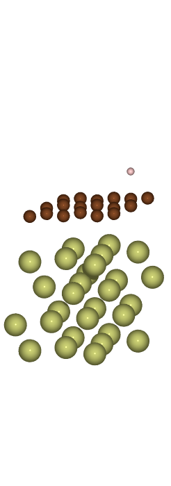
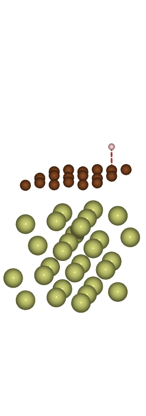
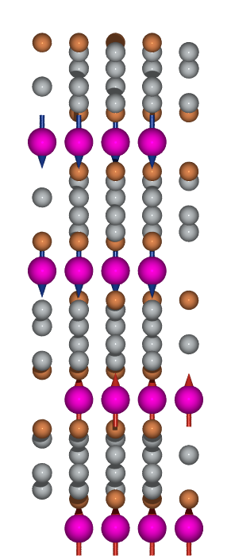
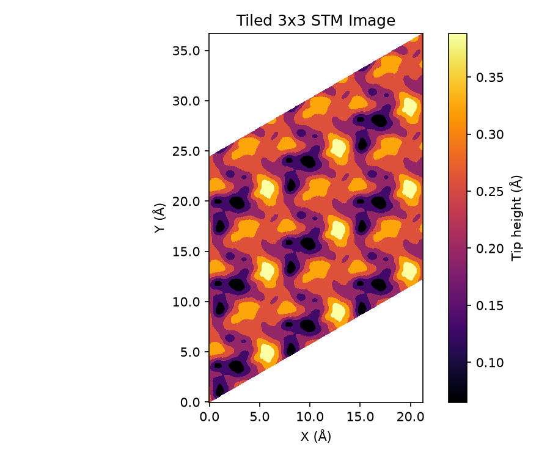

# tinykit

Tools for setting up and looking at VASP calculations. Slabs, adsorbates, charged cells, batch input generation, and structure rendering with POV-Ray.

## Install

```bash
uv sync          # or: pip install -e .
```

You get one command, `tk`. Every tool is a subcommand.

```bash
tk --help
tk slabgen --help
tk viz CONTCAR -o fig.png
```

Tab completion comes from argcomplete:

```bash
eval "$(register-python-argcomplete tk)"
```

## Input generation

`tk adsorb`, `tk slabgen`, and `tk charge` share the same INCAR/KPOINTS/POTCAR flags:

- `--preset NAME` picks a named INCAR preset (`adsorb`, `slab`, `charge`). Presets live in `src/tinykit/resources/incars.yaml`.
- `--incar FILE` uses your own INCAR instead.
- `--kpoints KX KY KZ` sets a gamma-centered mesh.
- `--functional NAME` sets the POTCAR family (default PBE).
- `-o/--output` sets the output directory. `--no-overwrite` skips directories that already exist.

`tk deploy` reads INCAR and KPOINTS from files instead of presets.

### adsorb

Put a molecule or single atom on a surface.

```bash
tk adsorb POSCAR H2O --supercell 2 2 1 -d 1.8
tk adsorb POSCAR Ag --multiple 2 --min-distance 2.0 --max-samples 50 --seed 0
tk adsorb POSCAR OH --multiple 3 --sites ontop bridge
```

Molecules come from a JSON file, or you pass an element symbol. Multiple adsorbates get symmetry-reduced, with optional random sampling. `-j` runs it across processes.

### slabgen

Cut slabs from a bulk structure.

```bash
tk slabgen POSCAR --hkl 111 --thicknesses 12 15 --vacuum 15
tk slabgen POSCAR --max-hkl 2
tk slabgen POSCAR --hkl 111 --freeze-mode bottom --layers 2
```

One Miller index or every index up to `--max-hkl`. Symmetric and asymmetric terminations, deduplicated. Selective dynamics with `center`, `bottom`, or `top` freezing.

### deploy

Turn a trajectory into one VASP directory per frame.

```bash
tk deploy structures.traj -i INCAR -k KPOINTS -o calcs/
tk deploy structures.extxyz --freeze 10.0
```

Reads anything ASE reads (XDATCAR, traj, extxyz, and so on).

### charge

NELECT series for charged slabs.

```bash
tk charge POSCAR --start 0.1 --stop 1.0 --step 0.1 --kpoints 5 5 1
tk charge POSCAR --dipole --start -0.5 --stop 0.5 --step 0.1
```

`--dipole` adds a dipole correction referenced at the center of mass.

## viz

Render a structure with POV-Ray. Works on slabs or bulk, any ASE-readable file. Colors and radii are the VESTA palette by default.



```bash
tk viz CONTCAR -o structure.png --rotation -75 0 0
```

Override color or radius per element with a YAML file:

```bash
tk viz CONTCAR -c styles.yaml
```

```yaml
Fe: [255, 100, 0]      # RGB 0-255
O:  "#00ff00"          # hex
C:  {radius: 0.75}     # radius only, or {color: ..., radius: ...}
```

### Dashed bonds

Draw a dashed line between two atoms. Indices are zero-based, after `--supercell`.



```bash
tk viz CONTCAR --bond 46 40 --bond-color '#cc2222' --bond-radius 0.07
```

Repeat `--bond` for more. Tune with `--bond-color`, `--bond-radius`, `--dash-length`, `--gap-length`.

### Charge density

Pass a CHGCAR or PARCHG and an isovalue.


```bash
tk viz PARCHG --isovalue 0.002 --dual-phase
```

`--dual-phase` renders both signs. Set color and transparency with `--iso-color` and `--iso-transmittance`.

### Magnetic moments

Draw moment arrows. Red is up, blue is down, green is in-plane.



```bash
tk viz CONTCAR --moments OUTCAR --collinear --supercell 2 2 1
```

Moments come from the OUTCAR. Collinear reads the total per atom, non-collinear reads the `magnetization (x/y/z)` tables. `--moment-threshold` hides near-zero moments, `--moment-by-magnitude` scales arrow length by moment size.

Rendering flags (all of viz): `--radius-scale` (ball-and-stick size, default 0.6), `--width`/`--height`, `--camera-dist`, `--orthographic`/`--perspective`, `--show-cell`, `--keep-pov`.

## stmplot

Constant-current STM images from a PARCHG or CHGCAR. Plots in real Angstroms and tiles oblique cells correctly.



```bash
tk stmplot PARCHG --current 0.0005 --tiles 3 --cmap inferno --clip 2 98
```

## surfind

Surface-localized states from PROCAR and OUTCAR.

```bash
tk surfind -s CONTCAR -p PROCAR -o OUTCAR --window 1.0 --layers 2
```

## magviz

Write magnetic moments to a CIF. Same OUTCAR source as `viz --moments`.

```bash
tk magviz vasprun.xml -o magmoms.cif       # non-collinear (vector)
tk magviz vasprun.xml --collinear          # collinear (scalar)
```

## Errors

Tools print `Error: ...` and exit nonzero. Set `TINYKIT_DEBUG=1` for the full traceback.

## Layout

```
src/tinykit/
  cli.py       tk dispatcher and shared CLI helpers
  adsorb.py    adsorbates on surfaces
  slabgen.py   slab generation
  deploy.py    batch VASP inputs from a trajectory
  charge.py    charged slabs
  viz.py       structure, isosurface, bond, and moment rendering
  stmplot.py   STM images
  surfind.py   surface states
  magviz.py    magnetic moments to CIF
  presets.py   INCAR presets
  vaspio.py    VASP input assembly and writing
  povray.py    POV-Ray rendering helpers
  resources/   incars.yaml, atom_templates.json (VESTA palette), generator
```

Tests run with `pytest`. They cover parsing and assembly without needing POTCARs or POV-Ray.
